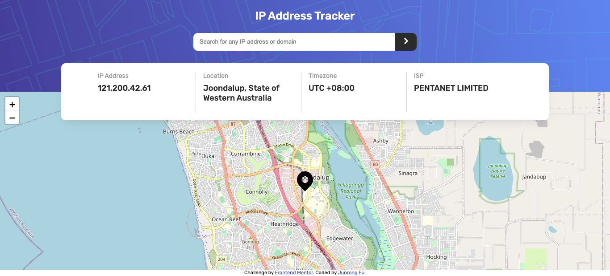
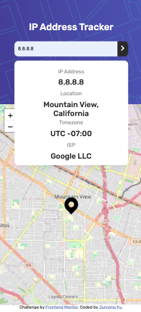

# Frontend Mentor - IP address tracker solution

This is a solution to the [IP address tracker challenge on Frontend Mentor](https://www.frontendmentor.io/challenges/ip-address-tracker-I8-0yYAH0). Frontend Mentor challenges help you improve your coding skills by building realistic projects.

## Table of contents

-   [Overview](#overview)
    -   [The challenge](#the-challenge)
    -   [Screenshot](#screenshot)
    -   [Links](#links)
-   [My process](#my-process)
    -   [Built with](#built-with)
    -   [What I learned](#what-i-learned)
    -   [Continued development](#continued-development)
    -   [Useful resources](#useful-resources)
-   [Author](#author)

## Overview

### The challenge

Users should be able to:

-   View the optimal layout for each page depending on their device's screen size
-   See hover states for all interactive elements on the page
-   See their own IP address on the map on the initial page load
-   Search for any IP addresses or domains and see the key information and location

### Screenshot




### Links

-   Solution URL: [https://github.com/akiraafu/ip-address-tracker]
-   Live Site URL: [https://ip-address-tracker-of1qfqn43-akiraafu.vercel.app/]

## My process

### Built with

-   Semantic HTML5 markup
-   CSS custom properties
-   Flexbox
-   JavaScript
-   Fetch
-   async await

### What I learned

```css
.proud-of-this-css {
    .header {
        min-height: 34vh;
    }
    @media (max-width: 768px) {
        .header .outputs {
            height: 100%;
            min-height: 15rem;
            flex-direction: column;
            top: 10rem;
            overflow: visible;
        }
    }
}
```

```js
const proudOfThisFunc = () => {
    const getGeoIp = fetch(API_URL)
        .then((response) => response.json())
        .then((ip) => {
            return [ip.location, ip.isp, ip.ip];
        });

    const printAddress = async () => {
        const a = await getGeoIp;
        // console.log(a);

        let location = a[0];
        let getRegion = location["region"];
        let getCity = location["city"];
        let timezone = location["timezone"];
        .
        .
        .
    };
};
```

### Continued development

none

### Useful resources

-   [MDN](https://developer.mozilla.org/en-US/)
-   [Stackoverflow](https://stackoverflow.com/)
-   [IP Geolocation API Docs](https://geo.ipify.org/docs)
-   [leafletjs Docs](https://leafletjs.com/reference.html)

## Author

-   Website - [akiraafu](https://github.com/akiraafu)
-   Frontend Mentor - [@akiraafu](https://www.frontendmentor.io/profile/akiraafu)
